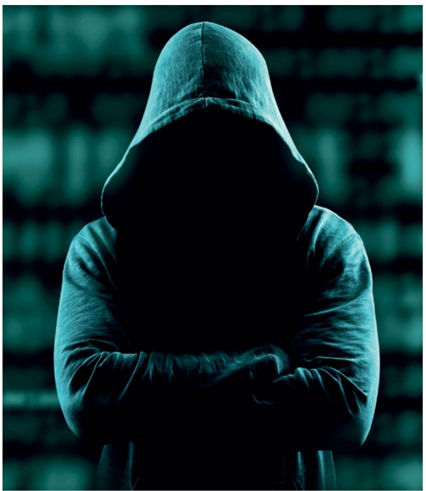
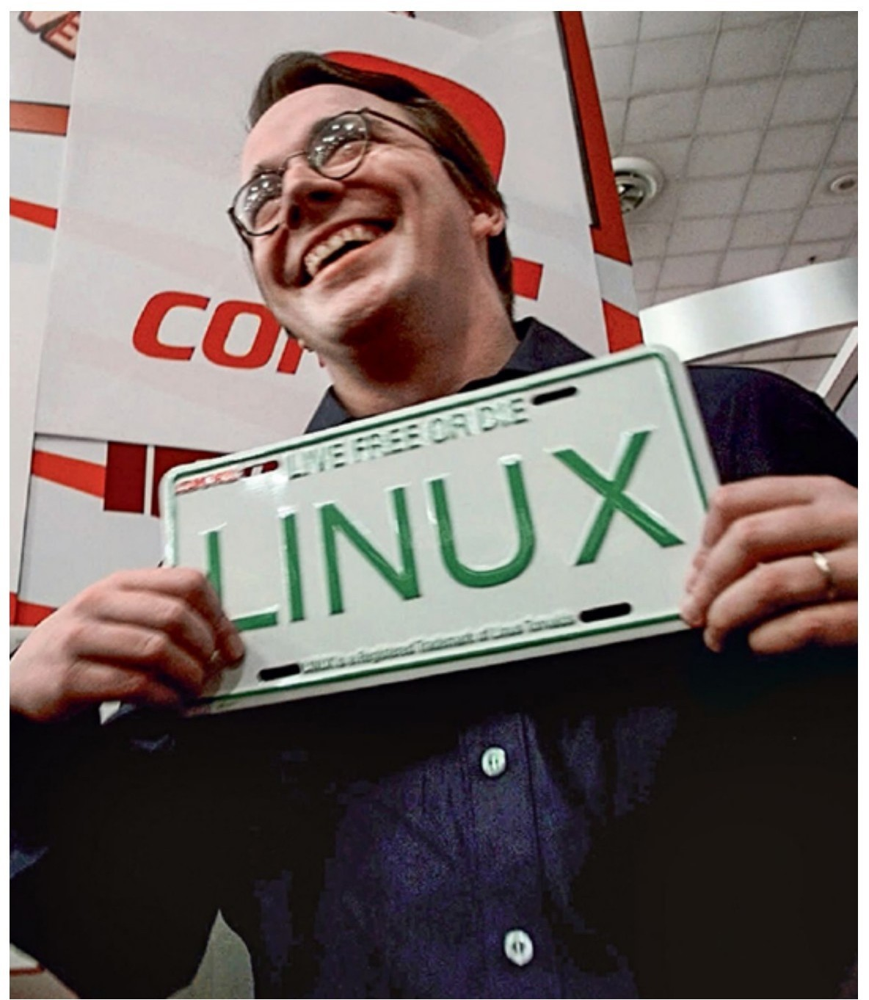
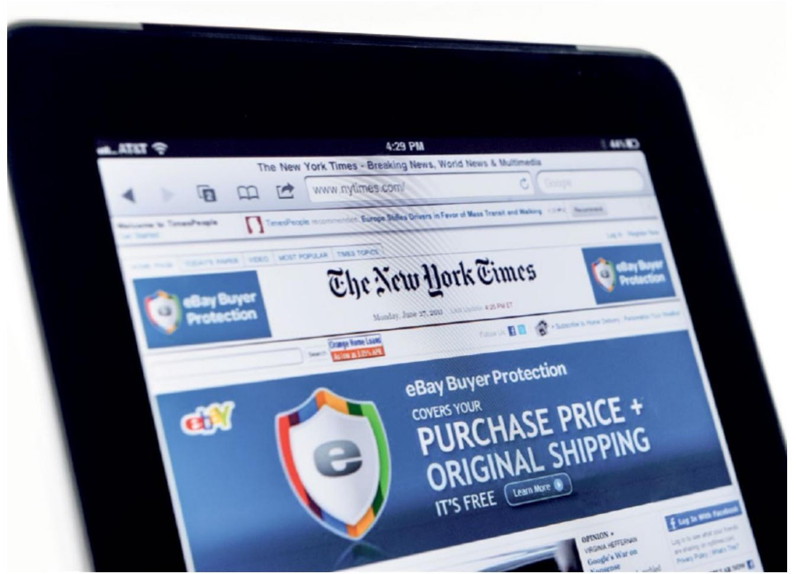

# Sejarah Komputer dari Tahun 1987 -1991

## 1987 GIF Graphics Interchange Format (Grafis Format Pertukaran) 
Format file adalah spesifikasi yang menggambarkan isi dan urutan dari informasi di dalam file komputer. Dan GIF adalah salah satu dari dua format file yang dibuat oleh web Mosaic browser yang didukung, dan satu-satunya yang bisa menampilkan warna. Perubahan format GIF telah dirancang untuk menampilkan grafik, bagan, dan logo.

## 1988  MPEG Motion Picture Expert Group (Kelompok Ahli Gambar Bergerak) 
MPEG adalah kumpulan standar terkait untuk pengkodean dan kompresi data audio-video. Contoh inovasi yang merupakan perkembangan dari standar ini termasuk pemutar MP3, CD, DVD, Disk Blu-ray, tablet, telepon dan kotak kabel. Istilah MPEG adalah singkatan dari Moving Picture Experts Group, yang dibentuk untuk mengembangkan dan menstandardisasi teknologi yang mendukung protokol.

## 1988 CD-ROM 
Disk optik adalah teknologi penyimpanan. CD-ROM menjadi media dominan untuk mendistribusikan perangkat lunak, yang dapat ditulis (CD-R) dan CD yang dapat ditulis ulang (CD-RW) menjadi format populer untuk backup dan pertukaran informasi. 

## 1989 World Wide Web 
mengubah internet dari rasa ingin tahu yang menjadi teknologi. dikombinasikan dengan browser web dan server web. Web menggabungkan tulisan hypertext dengan penerbitan elektronik, dengan penulisan (penerbit informasi dan pembaca tidak harus berada di komputer yang sama. Web individu dokumen) (seperti yang disebut pada saat itu) dirancang untuk menjadi diunduh melalui internet menggunakan Hypertext Transport Protocol (HTTP) yang ditemukan Berners-Lee. 

## 1989 SimCity 
SimCity adalah salah satu yang paling popular pada tahunnya yaitu game berpengaruh sepanjang masa. Ini mengantarkan jenis baru interaktif hiburan dan melahirkan serangkaian game simulasi yang lebih popular disebut The Sims. Itu juga berperan dalam meningkatkan minat dalam pemikiran perencanaan dan desain kota dan SimCity juga membantu memunculkan tipe game seperti ini.

## 1989 ISP Provides Internet Access to the Public (ISP Menyediakan Akses Internet untuk Publik)
Suatu hari, kepala UUNET Technologies, sebuah startup yang menyediakan akses internet berkecepatan tinggi untuk bisnis, bertanya kepada Shein apakah UUNET dapat memberikan beberapa peralatan telekomunikasi di ruang mesin Shein untuk melayani bisnis pelanggan di wilayah Boston. Shein menawarkan UUNET ruang secara gratis, asalkan UUNET langsung menghubungkan ke internet. 

## 1990 GPS Is Operational (GPS) 
adalah untuk menyediakan lokasi radio dan navigasi untuk pesawat militer AS dan kapal, penerima GPS saat ini seukuran koin kecil dan menyediakan informasi lokasi tidak hanya untuk kendaraan pemerintahan, tetapi untuk sipil kendaraan, pejalan kaki, dan bahkan benda mati seperti bangunan. Dapat mengurangi waktu yang dari setiap satelit, waktu saat ini dan tentukan jarak ke setiap satelit. Mengetahui jarak ini, bersama dengan satelit posisi yang sebenarnya. 

## 1990 Digital Money (Uang Digital) 
Saat ini kartu kredit dan debit adalah alat utama yang digunakan orang untuk membuat pembelian. Tetapi kartu-kartu ini lebih dari sekadar nilai transfer: untuk setiap transaksi, berisi identitas pembeli dan penjual. Yang bisa menjadi penghalang bagi banyak jenis kegiatan, baik legal maupun ilegal. Uang tunai dan koin sulit dipalsukan atau disalin, dan mereka tidak dapat dibelanjakan dua kali. 

## 1991 Pretty Good Privacy (PGP) 
Pretty Good Privacy (PGP) adalah program enkripsi email yang dikembangkan oleh Phil Zimmermann, seorang aktivis perdamaian dan pemrogram komputer yang peduli mendalam tentang hak privasi warga dunia. Pada tahun 1991, Zimmermann mengetahui ada RUU antikejahatan yang sedang diperdebatkan di Senat AS untuk mewajibkan perusahaan yang menjual produk enkripsi di Amerika Serikat untuk memasukkan "pintu jebakan" dalam perangkat lunak mereka sehingga pemerintah penyelidik bisa mendapatkan salinan dari pesan yang tidak terenkripsi yang disebut teks. 

**Menurut laporan David D. Clark (lahir 1944)**
pada tahun 1991 Ketika sistem komputer menjadi lebih canggih masyarakat menjadi lebih rentan terhadap desain sistem yang buruk, seperti serangan pada sistem computer, maka dari itu diperlukannya keamanan computer yang dapat melindungi data yang ada pada computer. 

**Pada tahun 1991**, seorang sarjana di Universitas Helsinki di Finlandia sedang menciptakan sistem operasi gratis. yaitu linux, yang dikembangkan oleh  Linus Torvalds ini. Sejak itu, minat pada Linux terus tumbuh, dan sekarang menjadi sistem operasi yang paling banyak digunakan di dunia, sebagian besar sebagai hasil adopsi oleh Google untuk sistem operasi Android.

**1992** munculnya perusahaan robotika pelopor yaitu Boston Dynamics . perusahaan ini  pembuat beberapa robot canggih yang pernah ada.  perusahaan ini  Didirikan oleh Marc Raibert, mantan profesor di Carnegie Mellon dan MIT. pada tahun 1992 juga ditemukan algoritma untuk mengompres foto agar ukurannya lebih kecil namun tidak mengurangi kualitas foto tersebut. dan juga pada tahun 1992 terdapat web browser yaitu perangkat lunak yang diperlukan untuk mengakses, mengambil, dan melihat informasi yang diinginkan oleh pengguna akhir

**pada tahun 1993** penyelenggara elektronik memiliki kemampuan dan fungsi yang terbatas seperti menyimpan nama, alamat, dan nomor telepon. Apple Newton adalah sesuatu yang jauh lebih ambisius: konsep ulang yang lengkap dari komputasi pribadi menjadi perangkat genggam portabel yang memungkinkan pengguna untuk mengakses dan menyimpan informasi, menulis, berkreasi, dan menciptakan.

**pada tahun 1994** adanya Iklan Spanduk pertama yang dirancang oleh Craig Kanarick dan Otto Timmons, Mereka yang mengklik spanduk akan dibawa ke situs web yang sudah terhubung

**pada tahun 1994** adanya tantangan untuk para pembaca untuk memecahkan kode RSA-129. Gardner menghadirkan tantangan kepada pembaca: pesan terenkripsi yang hanya dapat dipecahkan dengan memfaktorkan bilangan 129 digit yang hanya memiliki dua faktor, bilangan prima 64 digit dan bilangan prima 65 digit.  Ronald Rivest mengatakan bahwa dibutuhkan 40 kuadriliun tahun untuk memfaktorkan angka tersebut menurut perkiraan nya. Rivest menawarkan hadiah $100 kepada pemecah kode yang berhasil.
Kemudian seorang mahasiswa ilmu komputer berusia 21 tahun di MIT, memutuskan untuk memecahkan kode angka 129 digit. Atkins menyadari bahwa jumlahnya dapat dijangkau jika dia dapat meminta ratusan orang dari seluruh internet untuk membantu,  Dan dia mengumpulkan sekelompok kolaborator,  Selama beberapa bulan berikutnya, lebih dari 600 orang menyumbangkan waktu  untuk memecahkan RSA-129. Setelah delapan bulan, angka 129 digit difaktorkan, mengungkapkan pesan rahasia dari tahun 1977: KATA-KATA MAGIC ADALAH OSSIFRAGE SQUEAMISH

Pada tahun 1995 lahirlah DVD (digital video disc) yang diciptakan untuk menyimpan seluruh film panjang fitur ke dalam pelat keras yang dapat dibaca oleh computer. Terobosan teknologi DVD adalah realisasi bahwa data film dapat dikodekan dengan lekukan yang jauh lebih kecil, dikemas lebih rapat, jika laser yang digunakan untuk membaca data.

Pada tahun 1995, adanya ecommers (perdagangan elektronik) pertama yang diciptakan oleh Pierre Omidyar yaitu  eBay, ecommers ini untuk menjual barang-barang mereka satu sama lain.  Dia tahu dia tertarik pada sesuatu ketika penjualan pertamanya. Dia mendapatkan $14,83 untuk laser pointer rusaknya sendiri yang dibeli oleh seseorang yang mengoleksi laser pointer rusak. 

